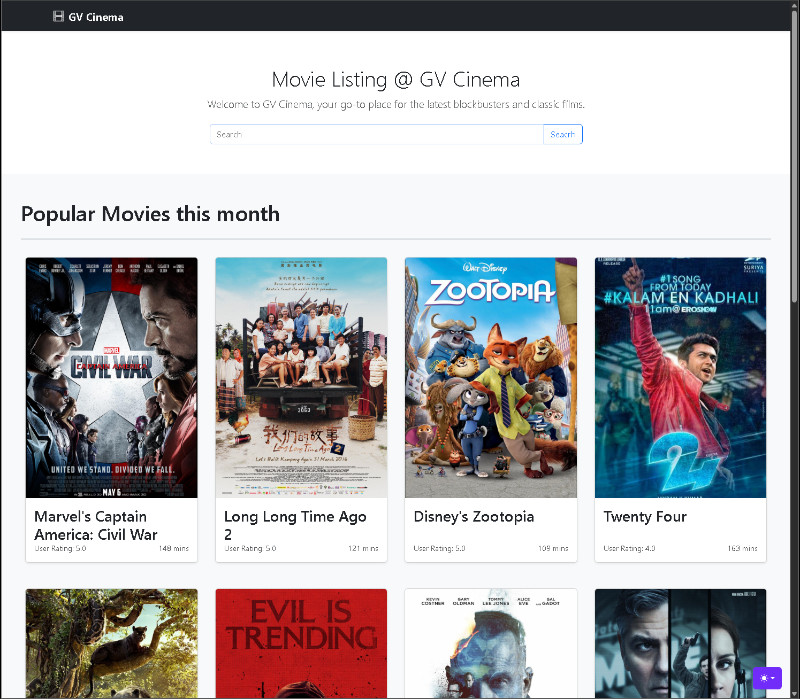
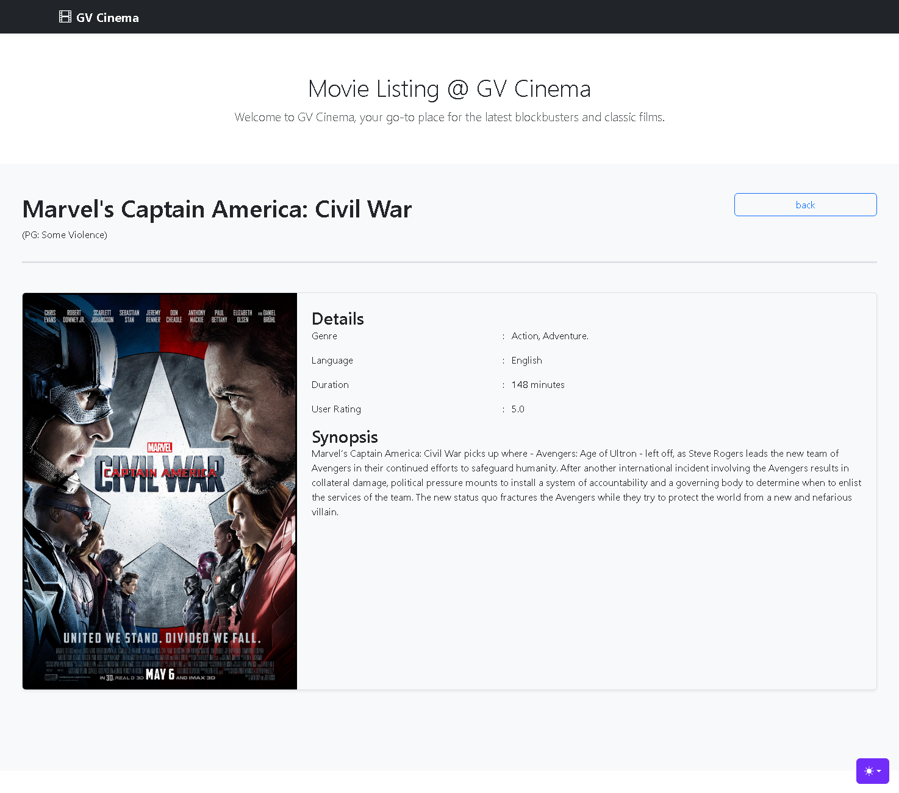

# Django Movie App

A listing Movie Django-based web application where you can search and view detail about the movie.

## 🔗 Table of content

- [Features](#Features)

- [Tech Stack](#TechStack)

- [Environment Variables](#EnvironmentVariables)

- [Installation](#Installation)

- [Usage/Examples](#Usage/Examples)

- [Screenshots](#Screenshots)

- [License](#License)

## 🔗 Features

✅ Listing Movies

✅ Search Movies

✅ Detail Movie

✅ Infinite Scroll 

- CRUD Genre , 
- CRUD MPAA Rating, 
- CRUD Movie, 
- Autocomplete for Genre and MPAA Rating

## 🔗 Tech Stack

**Backend:**

**Database:**

**Frontend:**

## 🔗 Environment Variables

To run this project, you will need to add the following environment variables to your .env file inside movie_apps

	SECRET_KEY = 'django-insecure-(=_rad&yu+m$=g@%oxs57#t@+y*znbs!vb%0**3p!w2l(zjk%6'
	DEBUG = 'True'
	SUPER_USER = admin
	SUPER_EMAIL = admin@gvcinema.com
	SUPER_PASS = password2025

## 🔗 Installation

🔹 Prerequisites
Ensure you have the following installed:

    Python (3.13)

    Git

🔹 Clone the Repository

	git clone git clone https://farizafkar-admin@bitbucket.org/farizafkar/django-movie-apps.git
	cd django-movie-apps

🔹 Create a Virtual Environment

	python -m venv env
	Windows: venv\Scripts\activate

🔹 Install Dependencies

	pip install -r requirements.txt

🔹 Apply Migrations

**Note**: db.sqlite3 already have record, you can skip this step.

	cd movie_apps
	python manage.py migrate #Intial create user
	python manage.py makemigrations #Update Models

🔹 Start the Development Server

	python manage.py runserver

Now, open http://127.0.0.1:8000/ in your browser.
## 🔗 Usage/Examples

🔹 Role-Based Access Control (RBAC)

    Login As:
    
    admin → CRUD access

🔹 CRUD Genre, MPAA Rating and Movie

    1. Go to http://127.0.0.1:8000/admin/

    2. Then login with the credential on .env

    3. After that go back to http://127.0.0.1:8000/ and click ☰ This hamburger icon 

🔹 Genre

    1. Click ☰ This hamburger on Navbar

    2. Click Go to Genre, then now be available at http://127.0.0.1:8000/list-genre

    3. Click Add Genre > Form Add New Genre > Fill the name > Click Add

    4. On Genre Table Click Update > Form Update Genre > Fill the new name > Click Update

    5. On Genre Table Click Delete > Form Delete Genre > Choose Yes or No

    6. On Search Input, Fill the Name Genre and click Search Button

🔹 MPAA Rating

    1. Click ☰ This hamburger on Navbar

    2. Click Go to MPAA Rating, then now be available at http://127.0.0.1:8000/list-mpaa-rating

    3. Click Add MPAA Rating > Form Add New MPAA Rating > Fill the name > Click Add

    4. On MPAA Rating Table Click Update > Form Update MPAA Rating > Fill the new Type or Label > Click Update

    5. On MPAA Rating Table Click Delete > Form Delete MPAA Rating > Choose Yes or No

    6. On Search Input, Fill the Type or Label MPAA Rating and click Search Button

🔹 Movie

    1. Click ☰ This hamburger on Navbar

    2. Click Go to Create, then now be available at http://127.0.0.1:8000/create-movie

    3. Fill The Create Movie Form > Name, Description, etc. and click Create

    4. Click Go to Movies, then now be available at http://127.0.0.1:8000/movies

    5. On List Movies Table Click Update > Form Update Movies > Fill the new input > Click Update

    6. On List Movies Table Click Delete > Form Delete Movies > Choose Yes or No

    7. On Search Input, Fill the Name Movies and click Search Button

🔹 Movie Listing & Detail
    
    1. Go to http://127.0.0.1:8000/

    2. Scroll down to Load more Movie

    3. Hover to poster movie and Click the poster. The landing page will now be available at http://127.0.0.1:8000/detail/1/Marvel's%20Captain%20America:%20Civil%20War

    4. On Search Input, Fill the Name Movies

## 🔗 Screenshots

## 🔗 License

)

## 🔗 Contact

  

